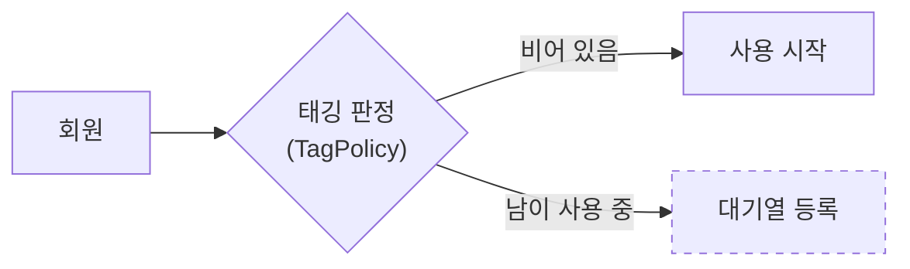

# 설계 문서 AI 작성 지시서

> AI 에이전트가 **설계 문서**를 만들고 고칠 때의 기준이다. 프로젝트 참여자가 비즈니스와 시스템 구조를 빠르게 이해하게 만드는 것이 목적이다.
> 되풀이하지 않는 것: 문서 정본 배치·상태 값 → [`../README.md`](../README.md) · 에이전트 권한과 정지선 → [`../../AGENTS.md`](../../AGENTS.md) §3·§5 · 제품 범위와 규칙 → 루트 [`../../README.md`](../../README.md)

---

## 1. 목적

설계 문서는 아래 셋을 모두 만족해야 한다.

1. **그림으로 빨리 파악된다** — 주요 비즈니스 흐름과 아키텍처를 UML·ERD 로 보여 준다.
2. **용어가 표로 정리되어 있다** — 신규 참여자가 용어집만 읽고도 회의를 따라간다.
3. **원본 소스를 에이전트 지시로 쉽게 고칠 수 있다** — 그림은 이미지가 아니라 텍스트 소스로 관리하고, 한 가지를 바꾸면 몇 줄만 바뀐다.

---

## 2. 기본 원칙

- **사람 중심.** 의사결정·흐름·경계를 이해시키는 데 집중한다. 구현 상세는 코드에 두고, 판단에 필요한 정보만 남긴다.
- **정본은 한 곳.** 어떤 사실이든 정본 문서는 하나이고 나머지는 링크한다([`../README.md`](../README.md) §1). 설계 문서도 예외가 아니다.
- **그림은 설계 의도, 사실은 코드.** 그림은 "이렇게 만들 생각이다" 를 보인다. 구현된 뒤의 사실(엔티티·마이그레이션·OpenAPI)은 코드가 정본이다. 구현이 그림과 달라지면 **같은 커밋에서 그림을 고친다.**
- **텍스트 소스 우선.** 다이어그램은 Mermaid 소스로 둔다. 이미지만 남기지 않는다.
- **작은 변경.** 수정 요청에는 전체 재작성보다 섹션·블록 단위 교체로 답한다.
- **추적 가능성.** 모든 설계 문서는 **기준 시점과 가정(Assumption)** 을 밝힌다. 모르는 것은 그럴듯하게 채우지 않고 `TBD` 로 남긴다.

---

## 3. 산출물

### 3.1 설계 문서 3종 + 단계 계획

| 문서 | 파일 | 정본으로 담는 것 | 최소 포함 |
|---|---|---|---|
| **A. 시스템 개요** | `docs/architecture/system-overview.md` | 비즈니스 흐름과 시스템 경계 | 컨텍스트 다이어그램(사용자·외부 시스템·경계) · 핵심 유스케이스 흐름 2~5개(**거부·실패 흐름 포함**) · 레이어 구성 |
| **B. 데이터 모델** | `docs/architecture/data-model.md` | 엔티티 설계 | 핵심 엔티티 ERD · 관계(1:N, N:M)와 그 의미 · 식별자·상태 값·감사 필드(`created_at` 등) 정책 |
| **C. 도메인 용어집** | `docs/business/domain-glossary.md` | 용어의 정의 | 아래 표 컬럼 5개 |
| 단계 계획 | `docs/plans/<단계>-<이름>.md` 예: `plans/2-2-domain-t1.md` | [`BUILD-PLAN.md`](../BUILD-PLAN.md) §3 한 칸의 세부 순서 | 세부 단계 · 확인 방법 · 결정 사항 |

- 3종은 기능별로 나누지 않고 **저장소 전체에 한 벌**이다. 기능의 범위·최소 보장은 여전히 `features/<슬러그>/README.md` 가 정본이다.
- **B 와 [`backend.md`](../architecture/backend.md) 의 경계**: B 는 엔티티 설계(무엇이 있고 어떻게 관계 맺는가), `backend.md` 는 백엔드 아키텍처(계층·의존 방향·매핑·동시성 처리)를 담는다. 현재 `backend.md` §4 에 있는 테이블 설명은 B 로 이관할 예정이다. 이관 전까지 B 를 새로 쓰면 `backend.md` §4 는 링크만 남긴다.
- B 는 물리 스키마가 확정되기 전에는 **논리 모델**로 쓴다. 컬럼 길이·인덱스 이름은 적지 않는다.

**C. 용어집 표 컬럼**

| 용어 | 정의 | 비즈니스 맥락 | 관련 엔티티·화면·API | 동의어·금지어 |
|---|---|---|---|---|

- 기능·화면 이름보다 **도메인 용어**를 먼저 등록한다(예: "태깅", "노쇼 유예").
- 비슷한 용어는 대표 용어 하나로 정규화하고, 나머지는 동의어·금지어 칸으로 보낸다.
- 용어를 바꾸면 그 용어를 쓰는 그림·API·화면 문서를 **같은 커밋에서** 함께 고친다.

### 3.2 공통 골격 — 섹션 번호는 고정한다

에이전트가 "§3 만 고쳐라" 로 일할 수 있도록 A·B·C 모두 아래 틀을 따른다. 본문은 번호를 붙이고, 뒤의 공통 네 섹션은 번호 없이 이름으로 둔다. 해당 없는 섹션도 지우지 말고 `해당 없음 — <이유 한 줄>` 로 남긴다. 번호가 밀리면 다른 문서의 `§n` 링크가 조용히 틀린다.

```markdown
---
status: planned
user_validated: false
---

# <문서 제목>

> 기준: 2026-09-19 · 입력 문서: 루트 README §3, features/equipment-queue/README.md
> 되풀이하지 않는 것: <정본 링크들>

## 1. … ## n.        — 본문. 문서별 최소 포함 항목. 그림마다 목적 한 줄 + 설명 2~4줄
## 가정               — 이 문서가 참이라고 두고 쓴 것
## TBD · 결정 필요    — | 항목 | 무엇이 정해지면 확정되는가 | 누구에게 |
## 변경 포인트        — "X 가 바뀌면 UC_…, Ent_… 를 고친다"
## 변경 이력          — | 날짜 | 변경 | 근거 |
```

단계 계획(`plans/`)은 `user_validated` 없이 `status` 만 갖고, 본문은 목표(완료 조건은 BUILD-PLAN 링크) · 세부 단계 표(`# | 할 일 | 산출물 | 확인 방법`) · 결정 사항(`결정 | 버린 선택지 | 근거`)으로 채운다.

---

## 4. 문서 상태와 용어집 참조 규칙

상태 값의 뜻은 [`../README.md`](../README.md) §2 가 정본이다. 설계 문서 3종은 여기에 `user_validated` 를 더한다.

| 필드 | 누가 바꾸나 | 뜻 |
|---|---|---|
| `status: done` | 에이전트 가능 | 최소 포함 항목이 채워졌고 `TBD` 가 남지 않았다 |
| `user_validated: true` | **사람만** | 개발자가 내용을 확인하고 확정했다 |

**에이전트는 `user_validated` 를 `true` 로 바꾸지 않는다.** 사람의 확인을 기록하는 값이라, 에이전트가 쓰면 의미가 사라진다.

### 용어집을 참조하기 전에

`docs/business/domain-glossary.md` 의 frontmatter 를 먼저 본다.

- **`status: done` 이고 `user_validated: true`** → 용어집을 기준 문서로 쓴다. 그림 라벨·표·새 문서의 용어를 여기에 맞춘다.
- **그 밖의 경우** → 용어집은 참고자료일 뿐이다.
  - 확정 표현은 루트 [`README.md`](../../README.md)(제품 정본)와 `features/<슬러그>/README.md` 에서 교차 확인한다.
  - 확정이 필요한 용어는 `가정` · `TBD` · `사용자 확인 필요` 중 하나로 표시한다. 초안 용어를 확정된 것처럼 단정하지 않는다.
  - 확정 용어 없이는 진행할 수 없으면 아래 문구로 멈춘다.

> 용어집이 아직 사용자 검증 완료 상태가 아닙니다. 용어 정의를 확정(`status: done`, `user_validated: true`)한 뒤 다시 요청해주세요.

---

## 5. 다이어그램 규칙

### 5.1 도구 — Mermaid 우선, Draw.io 는 보강

| 도구 | 언제 | 소스 보존 |
|---|---|---|
| **Mermaid** | 기본. 흐름·순서·상태·클래스·ERD | 문서 안 ` ```mermaid ` 블록이 곧 소스 |
| **Draw.io** | Mermaid 로 읽기 어려운 것만(예: 화면 기획, 자유 배치가 필요한 구성도) | `docs/<폴더>/assets/<이름>.drawio.svg` 로 저장한다. 원본이 SVG 안에 들어 있어 GitHub 에서 보이고 draw.io 로 다시 열어 고칠 수 있다. PNG 만 남기지 않는다 |

Mermaid 는 아래 다섯 종류만 쓴다. 실험 단계 문법(`C4Context`, `block-beta`, `architecture-beta` 등)은 렌더러마다 결과가 달라 쓰지 않는다.

| 보이려는 것 | Mermaid |
|---|---|
| 컨텍스트·판단 분기·레이어 | `flowchart` |
| 유스케이스의 호출 순서(거부 경로는 `alt`) | `sequenceDiagram` |
| 상태와 전이 | `stateDiagram-v2` |
| 클래스 구조 | `classDiagram` |
| 엔티티와 관계 | `erDiagram` |

디렉터리 트리와 명령 파이프라인은 그림이 아니라 목록이므로 ` ```text ` 블록으로 쓴다.

### 5.2 그림 하나에 목적 하나

- 그림 위에 **목적 한 줄**(이 그림이 답하는 질문), 아래에 **설명 2~4줄**(어디를 보면 되는가)을 둔다.
- 목적을 섞지 않는다. 컨텍스트와 호출 순서를 한 그림에 그리지 않는다.
- 노드가 **15개를 넘으면 쪼갠다.**
- **그림은 필요한 만큼만 그린다.** 표나 문장 한 줄로 충분하면 그림을 만들지 않는다. 그림이 많을수록 코드와 갈라질 곳이 늘어난다.
- 라벨은 **업무 용어를 먼저** 쓰고 기술 용어는 보조로 붙인다. 예: `"대기열 등록<br/>(QueuePolicy)"`.

---

## 6. 수정 용이성 규칙 (Agent-Friendly)

목표는 하나다: **한 가지를 바꾸면 한 줄만 바뀐다.**

### 6.1 ID 명명

| 접두사 | 대상 | 예 |
|---|---|---|
| `Actor_` | 사람 역할 | `Actor_Member` · `Actor_Admin` |
| `Sys_` | 외부 시스템·경계 | `Sys_Database` |
| `UC_` | 유스케이스 | `UC_TagEquipment` · `UC_ExtendSession` |
| `Layer_` | 레이어·모듈 | `Layer_Domain` · `Layer_Infrastructure` |
| `Ent_` | 엔티티(다른 문서에서 가리킬 때) | `Ent_Equipment` · `Ent_QueueEntry` |

- `erDiagram` 안에서는 박스 제목이 곧 ID 라, 접두사 없이 PascalCase 논리 이름(`Equipment`)을 쓴다. 변경 포인트나 다른 그림에서 가리킬 때는 `Ent_Equipment` 로 쓴다.
- `stateDiagram-v2` 의 상태 ID 는 코드의 enum 값(UPPER_SNAKE)을 쓰고, 한국어 이름은 `state "대기 중" as WAITING` 으로 붙인다.
- **ID 는 바꾸지 않는다.** 이름이 바뀌면 라벨만 고친다. ID 를 바꾸면 그 ID 를 쓰는 모든 줄이 diff 에 뜬다.

### 6.2 소스 작성

- ID 는 영문, **라벨은 큰따옴표 안에 한국어**로 쓴다. 괄호·슬래시·공백이 문법을 깨지 않는다.
- **노드 선언 → 관계 → 강조** 순서로 블록을 나누고 `%%` 주석으로 구분한다.
- **관계는 한 줄에 하나.** `A --> B --> C` 처럼 잇지 않는다.
- 색·테마·`%%{init}%%` 를 쓰지 않는다. 다크 모드에서 글자가 사라진다. 강조는 **새로 생기는 것 = 점선 테두리** 하나만 쓴다.
- 예약어(`end`, `graph`, `subgraph`, `class`, `state`)를 ID 로 쓰지 않는다. 줄바꿈은 `<br/>`, 꺾쇠는 `#lt;` `#gt;` 로 쓴다.

````markdown

````

### 6.3 고칠 때

- 고칠 섹션·블록만 연다. 섹션 번호와 제목은 바꾸지 않는다. 새 본문 섹션은 마지막 본문 번호 다음에 붙인다("가정" 바로 앞).
- 결정이 바뀌면 해당 표의 행을 고치고 "변경 이력" 에 한 줄을 남긴다. 옛 결정을 흔적 없이 지우지 않는다.
- 들여쓰기·순서 정리처럼 뜻이 바뀌지 않는 수정은 별도 커밋으로 한다.
- 설계가 통째로 바뀌면 고쳐 쓰지 않는다. 새 문서를 만들고 옛 문서는 `superseded` 로 두며 대체 링크를 단다.

---

## 7. 사용자 화면 문구 규칙

설계 문서나 프론트 화면(`apps/frontend`)에 사용자에게 보이는 문구를 쓸 때 적용한다. 문구의 출처는 **확정된 기획 문서**(루트 [`README.md`](../../README.md) §4 화면, 기능 README)에 있는 표현뿐이다. 따로 합의하지 않았으면 문구를 최소로 둔다.

- 화면에서 내부 구현·세션·인증·API 호출 구조를 설명하지 않는다.
- 요청받지 않은 소개 문구·히어로 카피·마케팅 문구·단계 설명을 넣지 않는다.
- 로그인 화면에는 최소한의 문구만 쓴다.
- 문구가 없어도 사용자가 작업을 할 수 있으면 지우는 쪽을 택한다.
- 서버의 거부 사유는 프론트가 새로 지어내지 않는다. 계약의 `reason` 에 대응하는 문구만 쓴다([`api-contract.md`](../architecture/api-contract.md)).

---

## 8. 요청 프롬프트 템플릿

사람이 에이전트에게 설계 문서를 요청할 때 아래를 채워 보낸다. 비어 있는 칸은 에이전트가 인터뷰로 묻는다.

```text
[입력]
- 대상 문서: system-overview | data-model | domain-glossary | plans/<단계>
- 주요 사용자: {{actors}}                  예: 회원, 관리자
- 핵심 시나리오: {{use_cases}}             예: 태깅, 연장, 노쇼 처리
- 확정된 기술·데이터 제약: {{constraints}}  예: MariaDB 단일, 세션 인증
- 미확정 사항: {{tbd_list}}

[사전 확인]
- 용어집 frontmatter 가 status: done, user_validated: true 인지 확인한다 (§4)
- 제품 정본(루트 README)과 기능 README 를 먼저 읽는다

[강제 규칙]
- docs/ai-agent/README.md 를 따른다
- 다이어그램은 Mermaid 우선, 필요할 때만 Draw.io(.drawio.svg)
- 각 문서에 가정 / TBD·결정 필요 / 변경 포인트 섹션을 둔다
- 구현 상세는 빼고 의사결정에 필요한 정보만 남긴다
- 문서만 쓴다. 구현은 확인을 받은 뒤에 한다

[출력]
- 파일별 변경 요약
- 핵심 가정 3~7개
- 다음 검토 질문 3개
```

---

## 9. 운영 방식

| 단계 | 누가 | 무엇을 |
|---|---|---|
| 초안 | 에이전트 | 결정이 사람 몫이면 먼저 인터뷰하고, 답에 따라 달라지는 질문만 한다. 문서는 `status: planned` 로 쓴다 |
| 확인 | 개발자 | 내용을 확인하고 `user_validated: true` 로 확정한다 |
| 구현 | 에이전트 | **확인을 받은 뒤에만** 착수한다([`AGENTS.md`](../../AGENTS.md) §5) |
| 갱신 | 에이전트 | 유스케이스·엔티티가 바뀌면 그 커밋에서 바로 반영한다. 반영 후 `user_validated` 는 `false` 로 되돌린다 |

아키텍처·DB·Breaking change 같은 구조적 변경은 [`AGENTS.md`](../../AGENTS.md) §1-4 와 §7 을 따른다. 사유·영향 범위·롤백 계획을 남기고, 결정은 개발자가 한다.

---

## 10. 마치기 전 체크리스트

- [ ] 신규 참여자가 10분 안에 핵심 비즈니스 흐름을 설명할 수 있는가?
- [ ] 용어집만 읽어도 회의에서 쓰는 용어를 따라갈 수 있는가?
- [ ] 다이어그램 소스에서 특정 유스케이스·엔티티만 골라 고칠 수 있는가? (§6 ID 규칙)
- [ ] 정상 흐름 외에 **거부·실패·권한 없음** 흐름이 있는가? 거부 사유가 계약의 `reason` 과 일치하는가?
- [ ] 동시성·인증·만료 처리처럼 핵심 비기능 요구가 설계에 드러나는가?
- [ ] 그림 라벨과 용어집 사이에 용어가 어긋나지 않는가?
- [ ] 유스케이스 → 그림 → 엔티티 → 용어로 추적이 이어지는가?
- [ ] TBD 마다 "무엇이 정해지면 확정되는지" 가 적혀 있는가?
- [ ] 용어집이 미검증이면 그 용어를 가정·확인 필요로 표시했는가?
- [ ] 정본에 있는 사실을 복사하지 않고 링크했는가? 그림이 필요한 만큼만 있는가?
- [ ] `user_validated` 를 에이전트가 `true` 로 바꾸지 않았는가?
