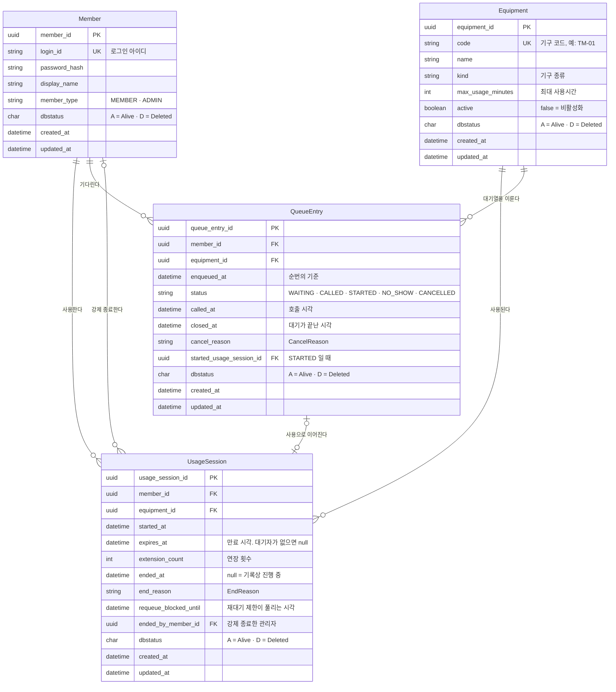
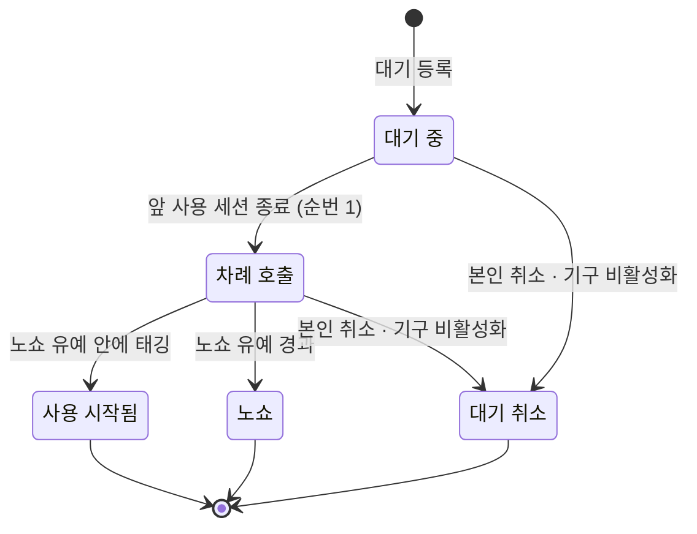

# 데이터 모델 — 엔티티와 관계

> 기준: 2026-09-19 · 입력 문서: 루트 [`README.md`](../../README.md) §3, [`domain-glossary.md`](../business/domain-glossary.md)(확정본), [`system-overview.md`](system-overview.md)
> 되풀이하지 않는 것: 규칙의 값 → 루트 [`README.md`](../../README.md) §3 · 용어 정의 → [`domain-glossary.md`](../business/domain-glossary.md) · 물리 매핑(컬럼 타입·인덱스·불변식을 DB 로 강제하는 방법) → [`persistence.md`](persistence.md)
>
> **논리 모델이다.** 컬럼 길이·인덱스 이름은 적지 않는다. 구현된 뒤의 사실은 엔티티 코드와 마이그레이션이 정본이다.

---

## 1. 한눈에 — 엔티티 넷

**이 그림이 답하는 것:** 무엇이 저장되고, 서로 어떻게 이어지는가.

- **대기열(`Queue`)은 테이블이 아니다.** 한 기구의 진행 중인 대기(`WAITING`·`CALLED`)를 등록 시각 순으로 늘어놓은 것이 곧 대기열이다.
- **이력 테이블이 없다.** 사용 세션과 대기는 한 번 생겨 한 번 끝나는 사건이라, 행을 물리적으로 지우지 않는 것만으로 이력이 된다(§6).
- N:M 관계는 없다. 회원과 기구는 사용 세션·대기를 통해서만 만난다.

---

## 2. 관계와 그 의미

| 관계 | 카디널리티 | 의미 | 삭제 시 |
|---|---|---|---|
| `Member` — `UsageSession` | 1 : N | 회원(`MEMBER` 유형만)은 사용 세션을 여러 번 가진다. **진행 중인 것은 최대 1개** | 물리 삭제가 없으므로 FK 가 끊기지 않는다(§6) |
| `Equipment` — `UsageSession` | 1 : N | 기구는 여러 번 사용된다. **진행 중인 것은 최대 1개** | 기구는 비활성화만 한다 |
| `Member` — `QueueEntry` | 1 : N | 회원(`MEMBER` 유형만)은 대기를 여러 번 가진다. **진행 중인 것(`WAITING`·`CALLED`)은 최대 1개** | |
| `Equipment` — `QueueEntry` | 1 : N | 기구의 진행 중인 대기들이 그 기구의 대기열이다 | |
| `QueueEntry` — `UsageSession` | 0..1 : 0..1 | `STARTED` 인 대기는 그로부터 시작된 사용 세션을 가리킨다. 비어 있는 기구를 바로 쓴 세션에는 대기가 없다 | |
| `Member`(관리자) — `UsageSession` | 0..1 : N | 강제 종료된 세션은 누가 끝냈는지 가리킨다. 기구 비활성화로 끝났다면 비활성화한 관리자다 | |

---

## 3. 식별자

| 대상 | 규칙 | 왜 |
|---|---|---|
| 모든 엔티티의 PK | **UUIDv7**. 도메인에서 생성한다 | 저장 전에 식별자가 있어야 T1·T2 가 DB 없이 엔티티를 만들고 비교할 수 있다. v7 은 시간 순이라 인덱스가 흩어지지 않는다 |
| PK 이름 | **`<엔티티>_id`** — `member_id` · `equipment_id` · `usage_session_id` · `queue_entry_id`. 단순히 `id` 라 쓰지 않는다 | 조인·로그·쿼리에서 어느 엔티티의 식별자인지 이름만으로 드러난다. FK 도 가리키는 PK 와 같은 이름을 쓴다 |
| 역할이 붙은 FK | 가리키는 PK 이름 앞에 역할을 붙인다 — `ended_by_member_id` · `started_usage_session_id` | 같은 엔티티를 두 번 가리킬 때도 이름이 겹치지 않는다 |
| `Equipment.code` | 자연 키. 유일. **바꾸지 않는다** | QR 에 인쇄되는 주소(`/e/TM-01`)의 일부라서, 바뀌면 붙어 있는 QR 이 틀어진다 |
| `Member.login_id` | 자연 키. 유일 | 로그인에 쓴다. 계정은 시드로 고정 |
| `Member.member_type` | `MEMBER`(일반 회원) · `ADMIN`(관리자) | 관리자는 **기구를 쓰지 않는 다른 유형의 회원**이다. 사용 세션·대기의 주인이 될 수 없고, 강제 종료의 주체만 된다 |

외부(URL·API)에 노출하는 기구 식별자는 `code` 다. UUID 는 내부 참조용이다.

---

## 4. 상태 값

### 4.1 사용 세션 — 상태 컬럼이 없다

사용 세션의 상태는 **시각 두 개로 정해진다.** 별도 상태 컬럼을 두면 시각과 어긋날 수 있다.

| 기록 | 뜻 |
|---|---|
| `ended_at` 이 null, `expires_at` 이 null | 진행 중. **대기자가 없어 시간 제한이 없다** — 본인이 끝낼 때까지 이어진다 |
| `ended_at` 이 null, `expires_at` 이 있음 | 진행 중이고 대기자가 있다. 단, `expires_at` 이 지났으면 실제로는 만료다 — 다음 태깅 때 지연 정리가 `ended_at = expires_at`, `end_reason = EXPIRED` 로 확정한다 |
| `ended_at` 이 있음 | 종료. `end_reason` 은 `ENDED_BY_MEMBER` · `EXPIRED` · `SWITCHED` · `FORCE_ENDED` 중 하나 |

현황의 "사용 중" 은 `ended_at` 이 null 이고 `expires_at` 이 null 이거나 지금보다 뒤인 세션이 있을 때다(호출 중인 대기도 사용 중으로 보인다 — [`system-overview.md`](system-overview.md) §2.1).

### 4.2 대기 — 상태 다섯

**이 그림이 답하는 것:** 대기는 어떤 상태를 거쳐 어떻게 끝나는가.

- 진행 중 = `WAITING` · `CALLED`. 끝난 상태 셋은 되돌아오지 않는다.
- `CALLED` 로의 전이와 `NO_SHOW` 는 **지연 정리가 기록한다.** 그 전까지 DB 에는 `WAITING`·`CALLED` 로 남아 있어도, 조회는 호출 시각을 계산해 올바른 상태를 보여 준다(§5).
- `CANCELLED` 는 `cancel_reason` 을 가진다 — `BY_MEMBER`(본인) · `EQUIPMENT_DEACTIVATED`(기구 비활성화).

### 4.3 불변식

| 불변식 | 최종 보증 |
|---|---|
| 한 기구에 기록상 진행 중인 사용 세션은 최대 1개 | **DB 제약** (방법은 [`persistence.md`](persistence.md) §3) |
| 한 회원에게 기록상 진행 중인 사용 세션은 최대 1개 | **DB 제약** |
| 한 회원에게 진행 중인 대기(`WAITING`·`CALLED`)는 최대 1개 | **DB 제약** |
| 한 기구에 `CALLED` 인 대기는 최대 1개 | 도메인 |
| 사용 세션·대기의 `member_id` 는 `MEMBER` 유형, `ended_by_member_id` 는 `ADMIN` 유형 | 도메인 |
| `expires_at` 이 있으면 그 기구에 진행 중인 대기가 있다 | 도메인 |
| `ended_at` 이 있으면 `end_reason` 이 있다, 없으면 없다 | 도메인 |
| `end_reason = FORCE_ENDED` ⟺ `ended_by_member_id` 가 있다 | 도메인 |
| `status = STARTED` ⟺ `started_usage_session_id` 가 있다 | 도메인 |
| `status = CANCELLED` ⟺ `cancel_reason` 이 있다 | 도메인 |
| 끝난 대기(`STARTED`·`NO_SHOW`·`CANCELLED`)는 `closed_at` 을 가진다 | 도메인 |

불변식은 모두 **`dbstatus = 'A'` 인 행만** 센다. DB 제약이 붙은 셋은 **동시 태깅 두 개가 판정을 함께 통과했을 때의 마지막 그물**이다. 판정은 먼저 도메인이 한다.

"기록상" 이 붙은 이유: 만료됐지만 정리되지 않은 세션도 진행 중으로 센다. 그래서 판정 전에 **태깅한 기구 E 와 태깅한 회원 M 의 기록을 먼저 정리**한다([`system-overview.md`](system-overview.md) §2.1). 그러지 않으면 이미 끝난 세션 때문에 새 세션이 제약에 걸린다.

---

## 5. 저장하는 값과 계산하는 값

| 값 | 저장 / 계산 | 어떻게 |
|---|---|---|
| **순번** | 계산 | 같은 기구의 진행 중 대기를 `enqueued_at` 순으로 센다. 앞 대기가 빠져도 다시 번호를 매기지 않는다 |
| **만료 시각** | 저장 (`expires_at`) | **대기자가 생길 때 정해진다.** 대기 등록 시각이 `started_at + max_usage_minutes` 보다 앞이면 그 시각, 이미 넘겼으면 대기 등록 시각 + 5분. 연장하면 +5분. 대기자가 모두 빠지면 다시 null. 최대 사용시간은 세션을 시작할 때의 값을 쓴다 — 관리자가 바꿔도 진행 중인 세션은 영향받지 않는다 |
| **남은 시간 · 마감 임박** | 계산 | `expires_at` 과 지금 시각. `expires_at` 이 null 이면 둘 다 없다(알림도 없다) |
| **호출 시각** | 계산 → 정리 때 저장 (`called_at`) | 앞 세션의 `ended_at`(없으면 `expires_at`), 앞 대기가 노쇼면 그 `called_at + 2분`. 지연 정리가 이 계산값을 그대로 기록한다 |
| **재대기 제한** | 저장 (`requeue_blocked_until`) | 사용 세션을 끝낼 때 그 기구에 대기자가 있었으면 `ended_at + 5분`, 없었으면 null. 그 회원이 같은 기구에 대기 등록하려 할 때 **지금이 이 시각 전이면 거부**한다 |
| **예상 대기 시간** | 계산 | 루트 README §3 의 식 |

- 시각은 모두 **서울 시간(`Asia/Seoul`, KST +09:00)** 으로 저장·판정·표시한다. 시간대 변환 계층을 두지 않는다. 한국은 서머타임이 없어 시각이 겹치거나 빠지는 구간이 없다.
- `max_usage_minutes` 를 세션에 따로 복사하지 않는다. 만료 시각이 정해지는 순간(첫 대기 등록)에 기구의 값을 읽는다. 그 사이에 관리자가 값을 바꾸면 바뀐 값이 쓰인다(→ 가정).

### 만료 시각을 바꾸는 방법

`expires_at` 은 `UsageSession` 의 메서드로만 바뀐다. 응용 서비스가 필드를 직접 쓰지 않는다([`backend.md`](backend.md) §2.6).

| 사건 | 유스케이스 | `UsageSession` 메서드 | 결과 |
|---|---|---|---|
| 첫 대기 등록 | `TagEquipment` | `onWaiterArrived(now, maxMinutes, rules)` | 최대 사용시간 전이면 `started_at + 최대 사용시간`, 이미 넘겼으면 `now + 초과 중 대기` |
| 마지막 대기가 취소 | `CancelQueueEntry` | `onWaitersGone()` | `null` |
| 연장 | `ExtendSession` | `extend(now, rules)` | `+ 연장`, `extension_count + 1` |
| 종료(모든 사유) | 여러 곳 | `end(reason, now, hasWaiters, rules, ?admin)` | `ended_at`·`end_reason`, 대기자가 있으면 `requeue_blocked_until` |

---

## 6. 감사 필드와 삭제

- 모든 엔티티는 `created_at` · `updated_at` · **`dbstatus`** 를 갖는다.
- **물리 삭제를 하지 않는다.** 삭제는 `dbstatus` 를 `'A'`(Alive)에서 `'D'`(Deleted)로 바꾸는 소프트 삭제다. 모든 조회·판정·불변식은 `dbstatus = 'A'` 인 행만 본다.
- **삭제와 업무 상태는 다르다.**

  | | 뜻 | 누가 보나 |
  |---|---|---|
  | `Equipment.active = false` (비활성화) | 업무 상태. 태깅할 수 없지만 기구는 존재한다 | 관리자 목록에 보인다 |
  | `dbstatus = 'D'` (삭제) | 데이터 상태. 잘못 들어간 행처럼 **없던 것으로 치는** 행 | 어디에도 보이지 않는다 |

  끝난 사용 세션·대기도 `dbstatus` 는 `'A'` 다. 끝난 것은 이력이지 삭제가 아니다.
- 지금 범위에는 **삭제를 일으키는 기능이 없다**(기구 관리 범위는 등록·수정·비활성화). `dbstatus` 는 데이터 정정을 위한 공통 장치로 먼저 둔다.
- "누가" 는 행이 말한다 — 사용 세션·대기의 주인은 `member_id`, 강제 종료만 예외라 `ended_by_member_id` 를 둔다. 본인 취소·본인 종료는 주인이 한 일이다.

---

## 7. 설계 결정

| 결정 | 버린 선택지 | 근거 |
|---|---|---|
| 행 자체를 이력으로 쓴다 | 상태 전이마다 한 줄씩 남기는 이력 테이블(옛 `reservation_history`) | 두 엔티티 모두 한 번 생겨 한 번 끝난다. 전이가 짧아 행의 시각 필드로 충분하다 |
| 회원을 DB 엔티티로 둔다 | Symfony 메모리 사용자 + 문자열 회원 ID | 사용 세션·대기가 FK 로 회원을 가리켜야 ERD 와 제약이 온전하다 |
| 순번을 계산한다 | 순번 컬럼을 저장하고 빠질 때마다 갱신 | 갱신이 동시성 문제를 새로 만들고, 지연 정리 중에 번호가 어긋날 수 있다 |
| 모든 엔티티에 `dbstatus`(`'A'`/`'D'`)로 소프트 삭제 | 물리 삭제 / 기구 비활성화만으로 대신 | 행 = 이력 구조에서 행을 지우면 이력이 끊긴다. 업무 상태(비활성화)와 데이터 상태(삭제)를 한 필드에 섞지 않는다 |
| 시각은 서울 시간으로 저장 | UTC 저장 + 표시할 때 변환 | 사용자·운영 모두 한국 한 곳이고 서머타임이 없다. 변환 계층이 없으면 DB 값을 그대로 읽어도 화면과 같다 |
| PK 이름을 `<엔티티>_id` 로 | 모든 PK 를 `id` 로 | 이름만으로 어느 엔티티인지 드러난다 |
| 사용 세션에 상태 컬럼을 두지 않는다 | `IN_USE`·`ENDED` 상태 컬럼 | `ended_at`·`expires_at` 과 따로 움직일 수 있는 값이 하나 더 생긴다 |
| 대기 취소는 상태 하나 + 취소 사유 | 상태를 둘로 나눔 / 구분 안 함 | 사용 세션의 종료 사유와 같은 모양. 비활성화로 인한 취소를 기록에서 구분할 수 있다 |
| 만료 시각은 대기자가 생길 때만 정한다 | 시작할 때 항상 `started_at + 최대 사용시간` | 기다리는 사람이 없으면 끊을 이유가 없다. 알림·연장도 대기자가 있을 때만 의미가 있다 |
| 재대기 제한은 풀리는 시각을 저장 | 종료 시 대기자 유무만 true/false 로 저장 / 대기 행 시각으로 매번 계산 | 판정이 "지금 < `requeue_blocked_until`" 하나로 끝나고, 필드 이름이 곧 뜻이다 |
| 관리자는 `member_type = ADMIN` 인 회원 | 관리자 별도 테이블 / 역할 문자열 | 로그인은 한 경로로 두고, 기구를 쓰지 않는다는 제약은 도메인이 유형으로 판정한다 |
| 지연 정리 범위 = 기구 E + 회원 M | 기구 E 만 | E 만 정리하면 M 의 다른 기구 세션이 이미 만료였어도 전환 종료로 기록되어 사실이 틀어진다 |

---

## 가정

- 시드 계정은 일반 회원 몇 명과 관리자 한 명이다.
- 기구 코드는 등록 후 바꾸지 않는다. 기능 문서의 "수정" 범위는 이름·종류·최대 사용시간이다([`equipment-catalog`](../features/equipment-catalog/README.md)).
- 삭제된 행(`dbstatus = 'D'`)도 유일성 검사에 포함한다. 삭제된 기구의 코드는 다시 쓸 수 없다 — 그 코드가 인쇄된 QR 이 남아 있을 수 있다.
- 연장은 대기자가 있을 때만 가능하므로 `extension_count` 는 사실상 0 또는 1 이다. 대기자가 모두 빠졌다가 다시 생겨도 횟수는 초기화하지 않는다 — 한 세션에 연장은 한 번이다.
- 만료 시각이 정해지기 전에 관리자가 최대 사용시간을 바꾸면, 만료 시각은 바뀐 값으로 계산된다.

## TBD · 결정 필요

없음.

## 변경 포인트

- 대기 상태가 늘면 §1 `QueueEntry.status`, §4.2 그림, §4.3 불변식, 용어집 §4 를 같은 커밋에서 고친다.
- 종료 사유가 늘면 §4.1 과 용어집 §3 `EndReason` 을 고친다.
- 규칙 값(유예 2분·연장 5분·재대기 5분·초과 중 대기 5분)이 바뀌면 루트 README §3 만 고친다. 이 문서의 §5 는 값을 예시로만 인용하므로 같이 고친다.
- 불변식을 DB 로 강제하는 방법이 바뀌면 [`persistence.md`](persistence.md) §3 에 쓰고, §4.3 의 "최종 보증" 칸은 그대로 둔다.

## 변경 이력

| 날짜 | 변경 | 근거 |
|---|---|---|
| 2026-09-19 | §5 에 "만료 시각을 바꾸는 방법" 추가(`backend.md` 옛 §2.6 에서 이관). 물리 매핑 링크를 `persistence.md` 로 | 엔티티의 상태 전이는 엔티티 설계 문서가 소유한다. 물리 매핑이 별도 문서로 분리됨 |
| 2026-09-19 | 사용자 수정 반영 — ① 대기자가 없으면 만료·연장·알림이 없다. `expires_at` 은 대기자가 생길 때 정해지고, 최대 사용시간을 넘긴 뒤 생기면 대기 등록 + 5분 ② 관리자는 기구를 쓰지 않는 `member_type = ADMIN` 회원 ③ `had_waiters_at_end` 대신 `requeue_blocked_until`(재대기 제한이 풀리는 시각) | 사용자 결정 |
| 2026-09-19 | 사용자 수정 반영 — ① PK 를 `<엔티티>_id` 로, 역할 FK 는 `ended_by_member_id`·`started_usage_session_id` ② 모든 엔티티에 `dbstatus`(`'A'` Alive / `'D'` Deleted) 소프트 삭제 ③ 시각은 UTC 대신 서울 시간 | 사용자 결정 |
| 2026-09-19 | 초안 작성. 엔티티 넷(Member · Equipment · UsageSession · QueueEntry), 대기 상태 다섯, 불변식, 저장/계산 구분 | 사용자 인터뷰 — 행 = 이력, Member 는 DB 엔티티, 지연 정리는 E + M, 순번은 계산, 대기 상태 WAITING·STARTED 추가, 취소는 상태 1개 + 사유 |
