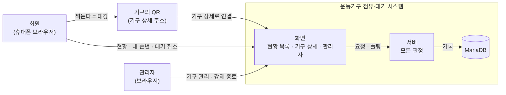
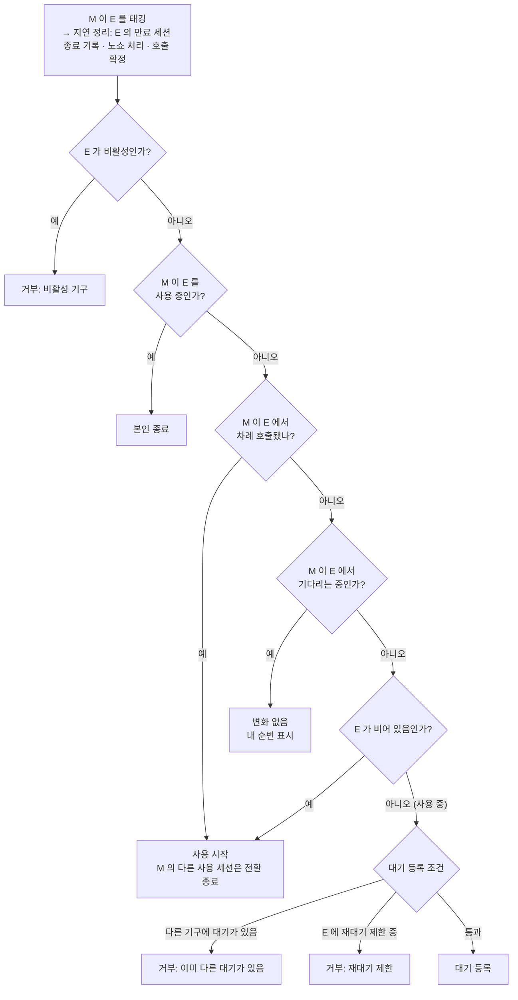
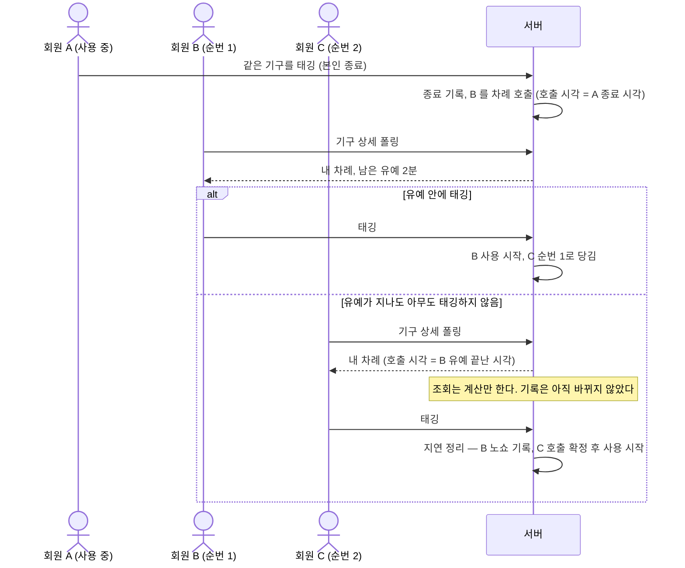
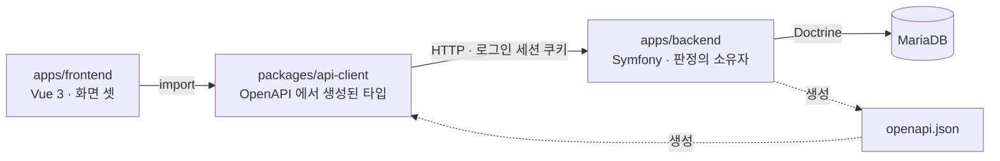

# 시스템 개요 — 누가 쓰고, 무엇이 어떻게 흐르는가

> 기준: 2026-09-19 · 입력 문서: 루트 [`README.md`](../../README.md) §2~§5, [`domain-glossary.md`](../business/domain-glossary.md)(확정본)
> 되풀이하지 않는 것: 규칙의 값과 근거 → 루트 [`README.md`](../../README.md) §3 · 용어 정의 → [`domain-glossary.md`](../business/domain-glossary.md) · 백엔드 내부 계층 → [`backend.md`](backend.md) · 계약 생성 경로 → [`api-contract.md`](api-contract.md) · 엔티티 → `data-model.md`(작성 예정)
>
> 그림은 **설계 의도**다. 구현된 뒤의 사실은 코드가 정본이다.

---

## 1. 컨텍스트 — 시스템의 경계

**이 그림이 답하는 것:** 누가 이 시스템을 쓰고, 경계 안에는 무엇이 있는가.

- 바깥에 있는 것은 **사람 둘과 QR 스티커**뿐이다. 외부 시스템 연동은 없다.
- QR 은 기구 상세 주소(`/e/<기구 코드>`)를 담은 종이일 뿐이고, 태깅의 판정은 전부 서버가 한다.
- 푸시 알림·RFID·결제·회원 가입은 경계 밖이다(루트 [`README.md`](../../README.md) §5). 차례가 왔다는 사실은 회원이 화면을 폴링해서 안다.

---

## 2. 유스케이스 흐름

### 2.1 태깅 판정 — 한 번의 태깅이 무엇이 되는가

**이 그림이 답하는 것:** 회원 M 이 기구 E 를 태깅했을 때, 서버는 어떤 순서로 무엇을 정하는가.

- **판정은 위에서 아래로 한 번만** 내려간다. 회원은 무엇을 할지 고르지 않는다 — 같은 QR 이 상황에 따라 시작·대기·종료가 된다.
- 첫 단계가 **지연 정리**다. 워커가 없으므로, 판정 전에 E 의 만료된 사용 세션과 유예가 지난 호출을 여기서 기록으로 확정한다. 그래야 "비어 있음"·"사용 중" 판단이 지금 시각 기준으로 맞다.
- "사용 중" 에는 **차례 호출된 대기가 노쇼 유예 중인 경우**도 들어간다. 그래서 호출 중인 기구를 다른 회원이 태깅하면 가로채지 못하고 대기 등록 쪽으로 간다.
- 사용 시작이 M 의 다른 사용 세션을 전환 종료하면, **그 기구의 대기열에서 차례 호출**이 일어난다(§2.2).
- 거부 세 가지는 정상 흐름이다. 화면은 서버가 준 거부 사유를 그대로 보여 준다([`api-contract.md`](api-contract.md)).

### 2.2 차례 호출과 노쇼 — 워커 없이 차례가 넘어가는 법

**이 그림이 답하는 것:** 사용 세션이 끝난 뒤 다음 사람에게 차례가 어떻게 넘어가고, 오지 않으면 어떻게 되는가.

- **호출 시각은 계산으로 정해진다.** 앞 사용 세션이 끝난 시각, 앞 대기가 노쇼였다면 그 유예가 끝난 시각이다. 기록이 늦게 남아도 이 시각은 바뀌지 않는다(루트 [`README.md`](../../README.md) §3 "호출 시각").
- 그래서 **조회는 상태를 바꾸지 않으면서도** 기록과 같은 답을 낸다. C 의 화면은 B 의 노쇼가 기록되기 전에도 "내 차례" 를 보여 준다.
- A 의 종료가 만료였다면 첫 줄이 없다. 만료 시각이 곧 호출 시각이고, 나머지 흐름은 같다.
- 대가: 폴링 간격만큼 늦게 알 수 있어서, 화면에 보이는 남은 유예가 2분보다 짧을 수 있다.

---

## 3. 레이어 구성 — 판정은 어디에 있는가

**이 그림이 답하는 것:** 요청은 어떤 층을 지나고, 규칙은 어느 층이 갖는가.

- **규칙은 `apps/backend` 에만 있다.** 프론트는 계약(타입·거부 사유)을 반영할 뿐 판정하지 않는다([`../../AGENTS.md`](../../AGENTS.md) §2).
- 점선은 런타임 호출이 아니라 **빌드 때의 생성**이다. 스펙을 바꾸고 재생성을 빼먹으면 CI 가 잡는다([`api-contract.md`](api-contract.md)).
- 백엔드 안의 계층(Domain · Application · Infrastructure · Ui)과 의존 방향은 [`backend.md`](backend.md) 가 정본이다.

---

## 가정

- 한 회원은 한 번에 한 기기에서만 조작한다. 같은 회원의 동시 요청 두 개가 겹치는 경우는 서버가 DB 제약으로 막는다고 두고, 이 문서에서는 그리지 않는다.
- 동시 대기 1개 규칙에서 두 번째 대기 등록은 **거부**한다. 기존 대기를 새 대기로 바꿔 주지 않는다(루트 README §3 은 "1개" 만 말한다).
- 대기 취소와 강제 종료·비활성화는 태깅이 아니라 화면 조작이라 §2.1 에 없다. 강제 종료·비활성화도 사용 세션을 끝내므로, 끝난 뒤의 흐름은 §2.2 와 같다.

## TBD · 결정 필요

| 항목 | 무엇이 정해지면 확정되는가 | 누구에게 |
|---|---|---|
| 거부 사유 코드 이름 | §2.1 의 거부 셋 중 `equipment_inactive` 만 정해져 있다. 나머지 둘의 `reason` 값은 [`backend.md`](backend.md) §3(재작성 대기)에서 정해지면 그림 라벨에 붙인다 | 개발자 (5-2 단계) |
| 폴링 간격 | 값이 정해지면 §2.2 의 "화면에 보이는 남은 유예가 짧아지는 폭" 을 적는다 | 개발자 (7 단계) |

## 변경 포인트

- 태깅 판정에 분기가 늘면 §2.1 에 `Is…` 판단 노드와 결과 노드를 추가한다. 순서가 바뀌면 루트 README §2 의 텍스트 흐름도 같은 커밋에서 고친다.
- 노쇼 유예·호출 시각 규칙이 바뀌면 §2.2 의 `alt` 블록과 설명을 고친다.
- 푸시 알림(Mercure 승격, 루트 README §6)이 들어오면 §1 에 서버 → 화면 화살표를, §2.2 에 폴링 대신 푸시를 그린다.
- 거부 사유 코드가 정해지면 §2.1 의 `Reject_…` 라벨에 코드를 붙이고 TBD 에서 지운다.

## 변경 이력

| 날짜 | 변경 | 근거 |
|---|---|---|
| 2026-09-19 | 초안 작성. 컨텍스트, 유스케이스 두 개(태깅 판정 · 차례 호출과 노쇼), 시스템 수준 레이어 | 사용자 인터뷰 — 유스케이스는 둘로, 레이어는 시스템 수준만, 흐름은 업무 수준 참가자로 |
